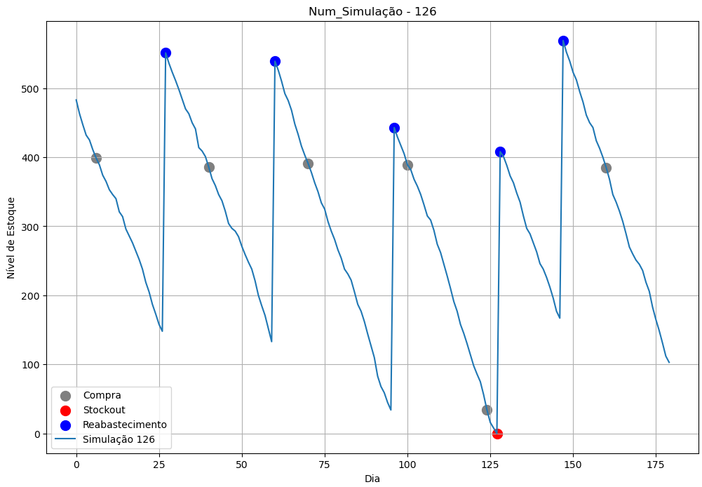
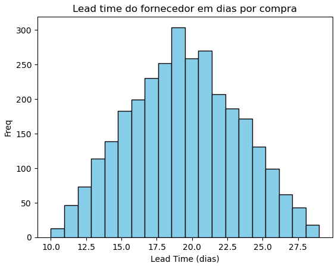
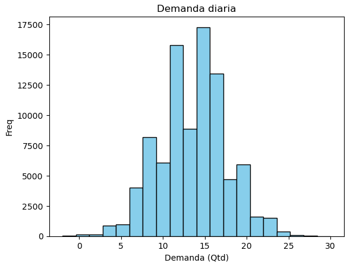
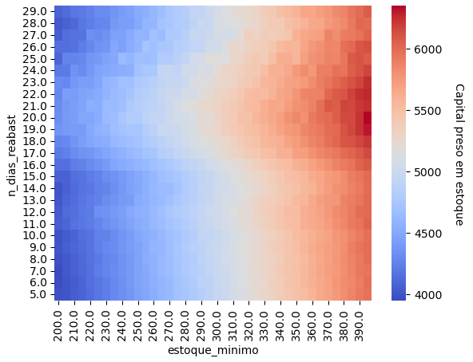
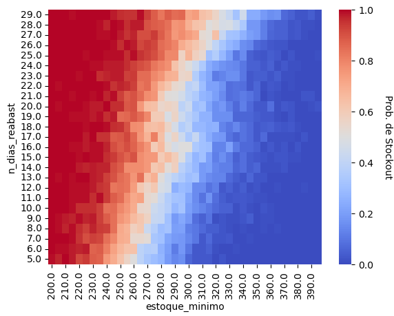
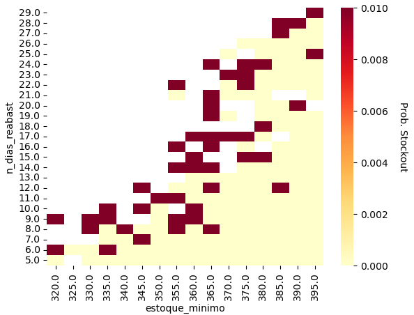
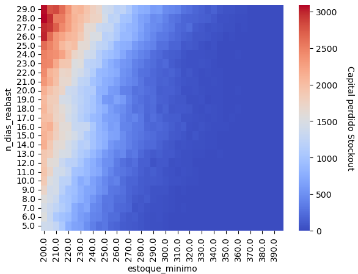
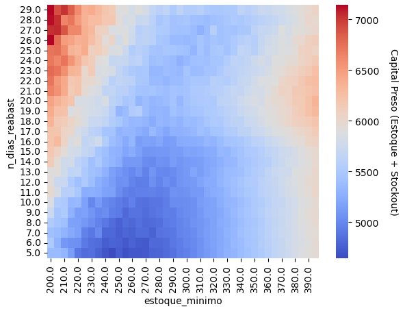

# Otimização de Capital de Giro via redimensionamento de estoque utilizando Simulações de Monte Carlo.

# Introdução
No mundo dos negócios, a eficiência na gestão do capital de giro é crucial para a saúde financeira de uma empresa. Um dos meios de se aumentar o capital de giro é redimensionando as políticas de estoque. O desafio de lidar com uma demanda variável e um lead time do fornecedor também variável, porém conhecidos, requer abordagens mais robustas. Nesse contexto, as simulações de Monte Carlo surgem como uma ferramenta poderosa para explorar diferentes cenários e tomar decisões data-driven.

# Objetivo

O objetivo deste estudo é explorar estratégias de otimização do capital de giro por meio de simulações de Monte Carlo. Em particular, buscamos identificar a política de compra mais adequada para maximizar o capital de giro, considerando a variabilidade da demanda e do lead time do fornecedor.

# Regras de negócios e parâmetros de simulação:

## Visualização Nivel de Estoque:

- Exemplo de visualização de nível de estoque em uma simulação com StockOut!

## Lead time do fornecedor:
- Definição: Período entre a data da realização do pedido e a entrega dos produtos.
- Premissa: Distribuição triangular em torno do lead máximo, mínimo e mais provável do fornecedor

 

## Demanda:
- Definição: Demanda diária do produto em unidades
- Premissa: Distribuição normal em torno da média = 14 e desvio padrão = 4

 

## Estoque Mínimo - Variável de decisão
- Nível de estoque que uma vez atingido deve ser efetuado uma compra imediatamente!

## Quantidade adquirida por compra - Variável de decisão
- Trata-se da quantidade a ser adquirida a cada compra, geralmente é definida em termos dos níveis de estoque atual, do lead time do fornecedor e da demanda
- Vamos simplificar essa variavel por outra N_DIAS_REABAST, bastanto multiplicá-la pela demanda diária para calcular a quantidade adquirida por compra.

Quantidade adquirida por compra = N_DIAS_REABAST * demanda_diaria

## Outros parâmetros:

### Variáveis de inicialização da simulação:
- num_simulacoes: Quantidade de simulações
- n_dias: Quantidade de dias para simular
- media_demanda_t0: Var inicialização da simulação t=0 - Média demanda
- desvio_padrao_demanda_t0: Var inicialização da simulação t=0 - Desvio padrão demanda
- qtd_comprada_t0:  Var inicialização da simulação t=0 - Qtd comprada ultima compra
- estoque_t0: Var inicialização da simulação t=0 - Nível de estoque

### Variáveis do fornecedor:
- preco_unitario_max: Var Fornecedor: Definidos pelo fornecedor se comprar só 1
- preco_unitario_min: Var Fornecedor: Definidos pelo fornecedor descontos extras caso compre o a partir de um máximo definido
- tempo_reposicao_min: Var Fornecedor: tempo mínimo para entrega
- tempo_reposicao_max: Var Fornecedor: tempo máximo para entrega
- tempo_reposicao_most_likely:  Var Fornecedor: tempo mais provavel para entrega
- b: Var fornecedor: controla taxa de decaimento do preço em detrimento da qtd_comprada

### Variáveis de negócio:
- elasticidade_preco_demanda: Var negócio: Elasticidade preco demanda observado para o produto
- **n_dias_reabast**: Var negócio: Cada compra terá que reabastecer a demanda prevista nos proximos n_dias_reabast 
- **estoque_minimo**: Var negócio: Estoque mínimo para ser triggado uma checagem para realização de uma compra.

# Metodologia

- 1) Escolha da política de compra: Inicialmente, será selecionada uma política de compra para ser avaliada.
- 2) Realização de simulações de Monte Carlo: Um grande número de simulações será conduzido, levando em conta a variabilidade da demanda e do lead time do fornecedor.
- 3) Avaliação de ocorrências de stockout: Será analisado quantas simulações resultaram em situações de stockout e por quantos dias.
- 4) Cálculo da probabilidade de stockout: A probabilidade de ocorrência de stockout será calculada em termos da proporção do total de simulações com stockout / total de simulações.
- 5) Estimativa da perda de capital: Será estimada a perda de capital decorrente do stockout. 
    - Estimativa = Probabilidade de Stockout * Dias_em_stockout * Demanda_diaria * Preco_unitário
- 6) Cálculo do capital imobilizado em estoque: Será determinada a quantidade média de capital imobilizado em estoque e compras em aberto.
    - Estimativa = Nivel_médio_estoque * Preco_unitário
- 7) Análise dos resultados: A estimativa do capital imobilizado em estoque será somado à estimativa de capital perdido decorrente do stockout para avaliar o impacto financeiro.
- 8) Repetição da simulação: O processo será repetido com outras políticas de compra para comparações.

# Resultados e Discussões

## Avaliação de capital imobilizado em estoque

 

- As melhores políticas de compra que minimizam o capital imobilizado em estoque é n_dias_reabast entre 5 e 7 e estoque mínimo entre 200 e 230, contudo é importante avaliar também os riscos de stockouts ao operar o estoque com essas políticas antes de tomar qualquer decisão.

## Avaliação de risco de stockout:

 

- Em geral, quanto menor o estoque mínimo e maior os n_dias_reabast maior é o risco de stockout
- Os riscos tendem a aumentar consideravelmente chegando a próximos de 100% com estoques mínimos abaixo de 260.
- Nas regiões de n_dias_reabast entre 5 e 7 e estoque mínimo entre 200 e 230 apontadas como ponto ótimo se considerarmos apenas o capital imobilizado em estoque há 33% de probabilidade de stockout. Será necessário estimar o capital perdido por stockout para tomada de decisão.

## Avaliação Cenários semelhantes
- Operação ocorre em estoque mínimo = 400 e n_dias_reabast = 30. Outras políticas de compras possívels para manter probabilidades de stockouts menores ou iguais as observadas (1%) são as ilustradas abaixo:

 

## Avaliação de capital perdido por stockout

 

- O Capital perdido por stockout segue a mesma tendência dos riscos de stockout
- Em geral, quanto menor o estoque mínimo e maior os n_dias_reabast maior é a perda de capital por stockout

## Avaliação capital total = imobilizado em estoque + perdido por stockout:

 

- Considerando as perdas em estoque e as perdas por stockout, a melhor área para se operar as políticas de compra é com estoque mínimo intermediário 210 á 270 e quantidade a ser comprada suficiente para abastecer 5 á 7 dias de demanda.
- Contudo, essa pode não ser as melhores especificações de política de compras, pois estamos desconsiderando 3 efeitos:

        1) Com compras mais frequentes há maior tempo alocado para realização de compras, esse tempo não entrou no indicador de capital gasto;  
        2) Elasticidade Preço-Demanda: Ao comprar em menor quantidade o fornecedor pode aumentar seus preços. O preço reajustado será repassado ao consumidor final e impactará na diminuição da demanda da produto. Não estamos considerando esse efeito pois passamos o parâmetro elasticidade = None nas simulações. 
        3) Com compras mais frequentes menor é o poder de negociação de prazos de pagamentos, o que impacta diretamente no capital de giro 

# Conclusões
As simulações realizadas sugerem que a melhor estratégia para otimizar o capital de giro, considerando as perdas por capital em estoque e perdas por stockout é adotar uma política de compra que priorize a aquisição em menores quantidades, e portanto, mais frequentes além de manter um estoque mínimo num nível intermediário entre 210 e 270. 

No entanto, é importante ressaltar que essas simulações não consideram outros fatores importantes para redimensionar o estoque visando a otimização do capital de giro. Por exemplo, não contemplam o aumento dos custos operacionais decorrentes da frequência elevada de compras, a possível perda de poder de negociação dos prazos de pagamento com fornecedores impactanto diretamente o capital de giro, além dos potenciais reajustes nos preços unitários devido à redução do volume comprado que podem influenciar na demanda em resposta às variação nos preços (Elasticidade Preco-Demanda).

É importante levar em consideração esses fatores na formulação de estratégias de gestão de capital de giro para uma abordagem mais abrangente e precisa. Apesar das limitações citadas, as simulações forneceram insights valiosos sobre a direção a seguir no gerenciamento do estoque e na mensuração de seus impactos financeiros.
